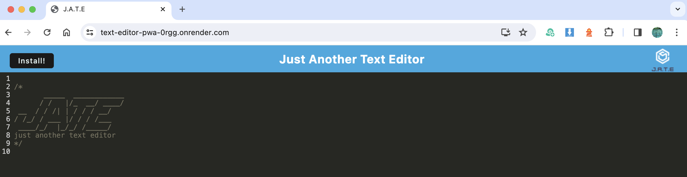

# JATE Just Another Text Editor

## Description
JATE (Just Another Text Editor) is a single-page application text editor that can be installed as a Progressive Web Application (PWA) and can run offline either in the browser or as a stand-alone web app. Syntax highlighting is set for JavaScript, and the text data is persistent across browser sessions.

## Table of Contents
- [Installation](#installation)
- [Use](#use)
- [Questions](#questions)
- [License](#license)

## Installation
The app has been deployed on Render, at the link below. Simply open in a browser to use.

<https://text-editor-pwa-0rgg.onrender.com>

Note that I am currently using the free tier of Render. If the app has not been accessed lately the spin-up time before the app displays can be up to a minute. I would recommend installing the app locally to avoid this delay.

If you are using a browser capable of installing Progressive Web Apps (such as Chrome or Edge on the desktop) an install button will be available as shown in the screenshot below. Once installed the app can be used offline and can be launched by double-clicking on the app. The install button will not appear if your browser does not have the ability to install PWAs or if the app is already installed on your computer.

You can also download or clone the source code. To use on your local machine you must have node.js installed. In a terminal navigate to the root directory and install dependencies with `npm run install.` There are a number of other scripts defined in the `package.json` file; examine that file for more information. If you wish to use the `npm run start:dev` script you will need to run `npm install` in the root directory first to install `concurrently` as a devDependency.

The build files are included in the repo but if you make any changes, run `npm run build` to create new file bundles. To start the app, run `npm start` and open `localhost:3000` in a browser.

## Use
A screenshot of the app (in a browser) is shown below. Simply type into the text editor area; the text will be persistent across sessions.

## Questions
Reach out if you have questions that are not covered here!

- GitHub username: clstevenson
- email: chrislstevenson@gmail.com

## License
This project is licensed under the terms of the [MIT license](https://opensource.org/licenses/MIT).
